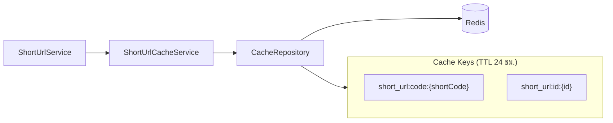
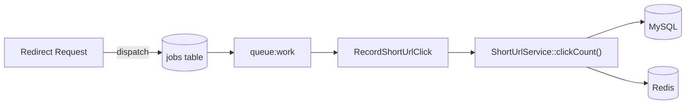
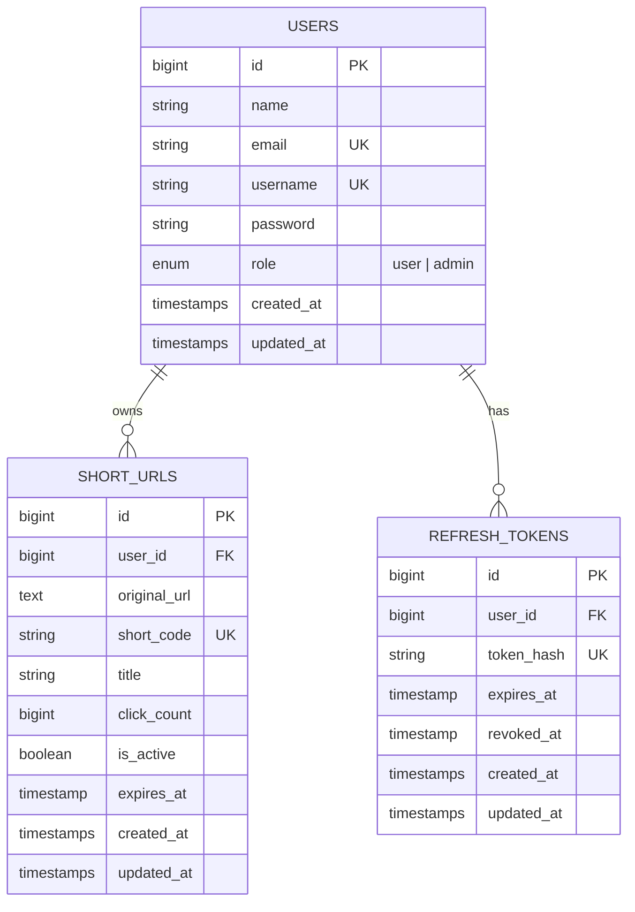

# System Architecture & Design

เอกสารนี้อธิบายสถาปัตยกรรมและการออกแบบของ **Laravel Short URL** — REST API สำหรับสร้าง จัดการ และ redirect ลิงก์สั้น พร้อมระบบ Authentication แบบ JWT และ Admin Panel

---

## 1. ภาพรวมระบบ (System Overview)

ระบบทำหน้าที่หลัก 3 ส่วน:

| ส่วน | รายละเอียด |
|------|------------|
| **Authentication** | ลงทะเบียน / เข้าสู่ระบบ / ออกจากระบบ / ต่ออายุ Token ด้วย JWT + Refresh Token |
| **Short URL (User)** | ผู้ใช้สร้าง ดู แก้ไข ลบ ลิงก์สั้นของตนเอง |
| **Short URL (Admin)** | Admin จัดการลิงก์สั้นทั้งหมดในระบบ |
| **Redirect** | เปิดลิงก์สั้นแล้ว redirect ไป URL ต้นทาง พร้อมนับจำนวนคลิกแบบ Async |

### Tech Stack

```
PHP 8.3+  │  Laravel 13  │  MySQL 8.4  │  Redis  │  JWT (tymon/jwt-auth)
Queue (database driver)  │  Scramble (API Docs)  │  Laravel Sail (Docker)
```

---


## 2. สถาปัตยกรรมแบบ Layered (Layered Architecture)

ระบบใช้ **Layered Architecture** แยกความรับผิดชอบชัดเจน โดย Controller ไม่มี Business Logic โดยตรง

### หน้าที่ของแต่ละ Layer

| Layer | โฟลเดอร์ | หน้าที่ |
|-------|----------|---------|
| **Presentation** | `app/Http/Controllers`, `app/Http/Requests`, `app/Http/Middleware` | รับ HTTP Request, Validate input, ส่ง Response JSON |
| **Application** | `app/Services` | Business Logic, Authorization check |
| **Domain** | `app/Models` | Entity, Relationship, Domain rules (`isAccessible()`, `isAdmin()`) |
| **Infrastructure** | `app/Repositories` | การเข้าถึง Database และ Cache ผ่าน Interface (Dependency Injection) |

### Dependency Injection

`AppServiceProvider` ผูก Interface กับ Implementation:

```
UserRepositoryInterface        → UserRepository
ShortUrlRepositoryInterface    → ShortUrlRepository
RefreshTokenRepositoryInterface → RefreshTokenRepository
CacheRepositoryInterface       → CacheRepository
```

---

## 3. โครงสร้างโฟลเดอร์ (Directory Structure)

```
app/
├── Http/
│   ├── Controllers/
│   │   ├── AuthController.php          # Auth สำหรับ User
│   │   ├── ShortUrlController.php      # CRUD + Redirect
│   │   └── Admin/
│   │       ├── AuthController.php      # ลงทะเบียน Admin
│   │       └── ShortUrlController.php  # จัดการ Short URL ทั้งระบบ
│   ├── Middleware/
│   │   └── AdminMiddleware.php         # ตรวจ role = admin
│   └── Requests/                       # Validation rules
├── Services/
│   ├── AuthService.php
│   ├── RefreshTokenService.php
│   ├── ShortUrl/
│   │   ├── ShortUrlService.php
│   │   └── ShortUrlCacheService.php
│   └── User/
│       ├── UserService.php
│       └── UserCacheService.php
├── Repositories/
│   ├── Interfaces/                     # Contracts
│   ├── Eloquent/                       # Database access
│   └── Cache/                          # Redis wrapper
├── Models/
├── Jobs/
│   └── RecordShortUrlClick.php
└── Helpers/
    └── ApiResponse.php                 # JSON response format
```

---

## 4. การออกแบบ Authentication

### 4.1 Token Strategy

ระบบใช้ **Dual Token** แยก Access Token กับ Refresh Token

| Token | ที่เก็บ | อายุ | วัตถุประสงค์ |
|-------|---------|------|--------------|
| **Access Token** | Client (JWT) | 15 นาที (`JWT_TTL`) | ยืนยันตัวตนทุก API request |
| **Refresh Token** | Client + DB (hash) | 30 วัน | ขอ Access Token ใหม่โดยไม่ต้อง login ใหม่ |

### 4.2 ความปลอดภัยของ Refresh Token

- เก็บเฉพาะ **hash** ในฐานข้อมูล (`hash_hmac('sha256', token, REFRESH_TOKEN_HASH_KEY)`)
- รองรับ **Token Rotation** — ใช้ refresh token ครั้งเดียวแล้ว revoke token เดิม
- Logout จะ revoke refresh token และ logout JWT guard

### 4.3 Role-Based Access Control (RBAC)

| Role | ค่าใน DB | สิทธิ์ |
|------|----------|-------|
| `user` | default | จัดการ Short URL ของตนเอง |
| `admin` | กำหนดตอน register | จัดการ Short URL ทั้งระบบ |

---

## 5. การออกแบบ Short URL

### โครงสร้างข้อมูล (Entity)

```
short_urls
├── id
├── user_id          → FK users (nullable, nullOnDelete)
├── original_url     → URL ต้นทาง
├── short_code       → รหัสสั้น 7 ตัว (unique)
├── title            → ชื่อ (optional)
├── click_count      → จำนวนคลิก
├── is_active        → เปิด/ปิดใช้งาน
├── expires_at       → วันหมดอายุ (default +30 วัน)
└── timestamps
```

**Domain Rule:** `isAccessible()` = `is_active == true` AND `expires_at` ยังไม่หมดอายุ

### Flow การ Redirect และนับคลิก

Redirect เป็น **Public endpoint** ไม่ต้อง auth — ออกแบบให้ตอบสนองเร็วโดยแยกการนับคลิกออกเป็น Background Job (Queue)

**เหตุผลที่ใช้ Queue:** การ redirect ต้องเร็ว — ไม่ block ผู้ใช้รอ DB write สำหรับนับคลิก

---

## 6. กลยุทธ์ Cache (Caching Strategy)



| เหตุการณ์ | พฤติกรรม Cache |
|----------|----------------|
| **อ่าน (findById / findByShortCode)** | `remember()` — อ่านจาก Redis ก่อน, miss แล้ว query DB |
| **อัปเดต / ลบ** | `forget()` — ลบทั้ง key ตาม `id` และ `short_code` |
| **นับคลิก (Job)** | `set()` — อัปเดต cache ด้วยข้อมูลใหม่หลัง increment |

**เหตุผลหลักที่เลือก TTL 24 ชม.:**

1. **Redirect ถูกเรียกบ่อยที่สุด** — path `GET /short-urls/{shortCode}` ต้อง lookup `original_url`, `is_active`, `expires_at` ทุกครั้ง การ cache 24 ชม. ช่วยลด query ซ้ำบน MySQL สำหรับลิงก์ยอดนิยมได้มาก
2. **ข้อมูล metadata เปลี่ยนไม่บ่อย** — URL ต้นทาง, สถานะ active, วันหมดอายุ มักคงที่หลังสร้าง ไม่จำเป็นต้อง expire cache เร็วเหมือนข้อมูล real-time
3. **TTL เป็น safety net ไม่ใช่กลไกหลักของความถูกต้อง** — เมื่อ user/admin แก้ไขหรือลบ ระบบเรียก `forget()` ทันที ไม่ต้องรอ TTL หมด; เมื่อมีคลิก Job จะ `set()` ค่าใหม่ (รวม `click_count`) และ reset TTL อีก 24 ชม.

**สรุป:** 24 ชม. ออกแบบมาเพื่อให้ redirect เร็วและลด load DB สำหรับ read-heavy path ส่วนความสดของข้อมูลพึ่ง `forget()` / `set()` เป็นหลัก TTL เป็นแค่ fallback กรณี key ไม่ถูก invalidate ด้วยตนเอง

User data ใช้ `UserCacheService` ในรูปแบบเดียวกัน (`user:id:{id}`)

---

## 7. การออกแบบ Queue

| รายการ | ค่า |
|--------|-----|
| Driver | `database` (`QUEUE_CONNECTION`) |
| Job | `RecordShortUrlClick` |
| Trigger | ทุกครั้งที่มี redirect ผ่าน `GET /short-urls/{shortCode}` |
| Worker | `./vendor/bin/sail artisan queue:work` |



---

## 8. Database Schema (ER Diagram)



### Indexes สำคัญ

| ตาราง | Index | วัตถุประสงค์ |
|-------|-------|--------------|
| `short_urls` | `short_code` (unique) | Lookup ตอน redirect |
| `short_urls` | `user_id` | ดึงรายการของ user |
| `refresh_tokens` | `token_hash` (unique) | ตรวจ refresh token |
| `users` | `email`, `username` (unique) | Login lookup |

---

## 9. API Response Format

ทุก API endpoint ใช้รูปแบบ JSON เดียวกันผ่าน `ApiResponse` trait

**Success:**
```json
{
  "status": "success",
  "message": "Short URL created successfully.",
  "data": { ... }
}
```

**Paginated:**
```json
{
  "status": "success",
  "message": "Short URLs fetched successfully.",
  "data": [ ... ],
  "pagination": {
    "current_page": 1,
    "per_page": 15,
    "total": 42,
    "last_page": 3
  }
}
```

**Error:**
```json
{
  "status": "error",
  "message": "Validation failed.",
  "errors": { "original_url": ["The original url field is required."] },
  "data": null
}
```

Exception handling สำหรับ route `api/*` ถูกกำหนดใน `bootstrap/app.php` — คืน JSON เสมอ (401, 403, 422, 500)

---

## 10. Design Decisions (เหตุผลการออกแบบ)

| การตัดสินใจ | เหตุผล |
|-------------|--------|
| **Repository Pattern + Interface** | แยก data access ออกจาก business logic, ทดสอบและเปลี่ยน implementation ได้ง่าย |
| **Service Layer** | Controller บาง — logic รวมอยู่ที่ Service, reuse ได้จาก Job และ Controller |
| **Cache-aside (Redis)** | Redirect ถูกเรียกบ่อย — cache ลด load บน MySQL |
| **Queue สำหรับ click count** | Redirect ต้องเร็ว — แยก write ออกเป็น async |
| **JWT + Refresh Token แยกกัน** | Access Token อายุสั้นลดความเสี่ยง, Refresh Token หมุนเวียนได้ |
| **Hash Refresh Token ใน DB** | แม้ DB รั่ว ก็ไม่สามารถใช้ plain token ได้ |
| **Authorization ใน Service** | User แก้/ลบได้เฉพาะ short URL ของตน (`findByIdAndUserId`) — Admin bypass ผ่าน endpoint แยก |
| **Scramble** | Auto-generate API docs จาก code — ลด drift ระหว่าง docs กับ implementation |

---

## 11. ข้อจำกัดและข้อควรระวัง

1. **Queue Worker** — ต้องรัน `queue:work` ไม่งั้น click count จะไม่ถูกบันทึก
2. **Cache Invalidation** — อัปเดต/ลบ short URL จะ `forget()` cache อัตโนมัติ แต่ถ้า Redis ล่ม cache จะ rebuild จาก DB
3. **Short Code Collision** — สุ่มสูงสุด 5 ครั้ง ถ้าชนกันทั้งหมดจะ throw `RuntimeException`
4. **Admin Register เป็น Public endpoint** — `/auth/admin-register` ไม่มี protection เพิ่มเติม (ควรจำกัดใน production)
5. **Default Expiration** — Short URL ใหม่หมดอายุใน 30 วันหากไม่ระบุ `expires_at`
